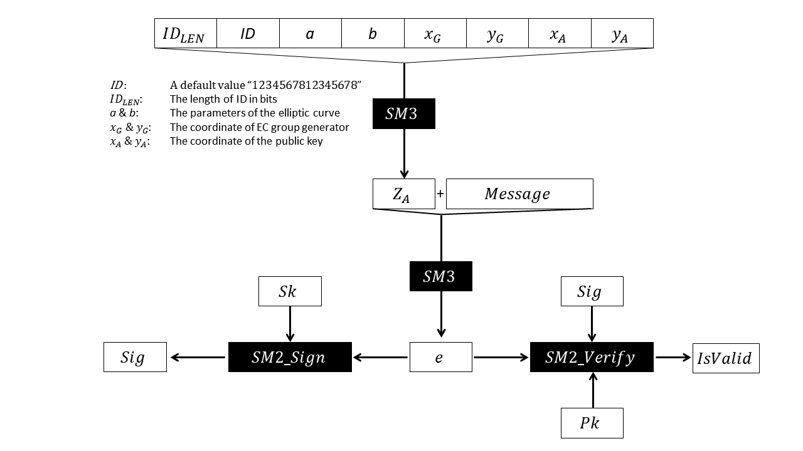

# SM2

SM2 can be used in digital signature.

Algorithms below are related:

- Key generation
- Sign
- Verify
- Serialization and deserialization

## Create a New Contex

By creating a context, libsm will initialize all the parameters used in those algorithms, including ECC parameters.

```
use libsm::sm2::signature::{Pubkey, Seckey, Signature, SigCtx};
let ctx = SigCtx::new();
```

## Generate a Key pair

```
let (pk, sk) = ctx.new_keypair();
```

`pk` is a public key use for verifying. `sk` is a secret key used for signing.

The public key can be derived from the secret key.

```
let pk = ctx.pk_from_sk(&sk).unwrap();
```

## Sign and Verify

```
let signature = ctx.sign(msg, &sk, &pk);
let result: bool = ctx.verify(msg, &pk, &signature);
```

## Serialization and Deserialization
 
Keys and Signatures can be serialized to ``Vec<u8>``.

### Public Key

```
let pk_raw = ctx.serialize_pubkey(&pk, true);
let new_pk = ctx.load_pubkey(&pk_raw[..])?;
```

if you want to compress the public key, set the second parameter of `serialize_pubkey()` to `true`. An uncompressed public key will be 65 bytes, and the compressed key is 33 bytes.

The return value of `load_pubkey()` is ``Result<Pubkey, bool>``. If the public key is invalid, an error will be returned.

### Secret Key

```
let sk_raw = ctx.serialize_seckey(&sk);
let new_sk = ctx.load_seckey(&sk_raw[..])?;
```

The output size of `serialize_seckey()` is 32 bytes.

The return value of `load_seckey()` is `Result<Seckey, bool>`. An error will be returned if the secret key is invalid.

### Signature

Signatures can be encoded to DER format.

```
let der = signature.der_encode();
let parsed_sig = Signature::der_decode(&der[..])?;
```

## Details of How the Signature is Generated

### 1. Calculate Z_A

First, an `ID` is needed. But in certification applications, no ID is given. So according to the standard, we use the default value, which is "1234567812345678". Then we calculate the length of ID in bits, which is 16 * 8 = 128, and name it as `ID_LEN`. `ID_LEN` should be a 16-bit number in big-endian.

Then, the parameters of the elliptic curve should be given, include `a` and `b` in the curve eqution, and the coordinate of EC group generator, which is `x_G` and `y_G`. For details, see [the standard](http://www.oscca.gov.cn/sca/xxgk/2010-12/17/1002386/files/b965ce832cc34bc191cb1cde446b860d.pdf). And the coordinate of the public key should be appended, which is `x_A` and `y_A`. All of them are 32-byte big-endian numbers.

Hash the concatenation using SM3, and we can get Z_A.

```
Z_A = SM3(ID_LEN || ID || a || b || x_G || y_G || x_A || y_A)
```

Z_A is a 32-byte big-endian number.

### 2. Calculate the Final Hash

Prepend Z_A before the message, and hash again using SM3, then we can get `e`.

```
e = SM3(Z_A || M)
```

### 3. Verify the Message

Finally, `e` is verified by SM2 algorithm. See section 6.2 and 7.2 of the second part of [this documentation](http://www.oscca.gov.cn/sca/xxgk/2010-12/17/1002386/files/b791a9f908bb4803875ab6aeeb7b4e03.pdf).

```
isValid = SM2_Verify(e, signature, publicKey)
```

Signatures generated by this library is compatible with [GmSSL](https://github.com/guanzhi/GmSSL).

Be careful, in SM2, we **cannot** recover the public key using the message and the signature, like what Ethereum did. Because before the verification, the public key must be provided to calculate `e`. To solve this, append the public key after the signature, and extract it before the verification.



